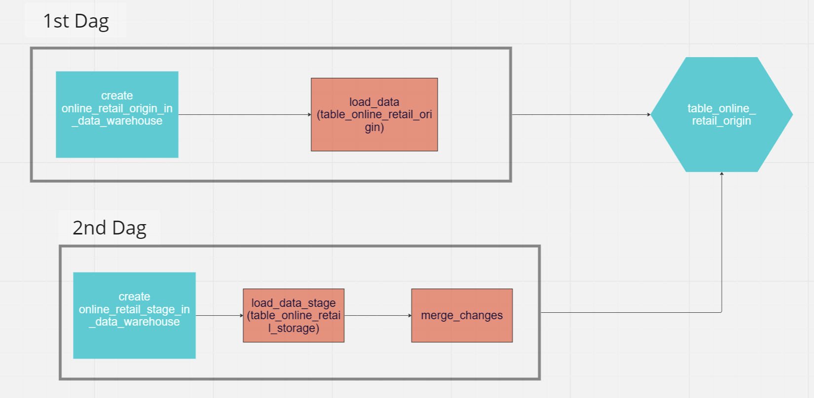

# step1 :
```bash
docker-compose build
```

# step2 :
```bash
docker-compose up -d
```

# delete container
```bash
docker-compose down -v
```

# check IP Address

```bash
docker inspect pg_container
```

# Data Pipeline


Ref in doing this : http://www.dbaglobe.com/2022/07/use-merge-feature-in-postgresql-15-to.html
-----

---
# What is it about
This Data pipeline has shown the simple CDC (Change Data Capture) in query-based with Merge on Postgres.
There are many ways to do the CDC--either tool-based or query-based.
In this case, I will use the "Query-based"

What needed in structured data are 'Operation Column', consisting of 'D' (Delete), 'U' (Update), 'I' insert; lastly, the timestamp' column

However, why do we need the timestamp column?
The answer is in the word 'Change Capture'.
In real case scenrios, the data could be updated many time.

For example, the cashier has mistakenly put the wrong address, or quantity.
Or...Maybe the goods were refunded

We need to know to 'capture' the last time that the data was updated (In this case, it is 'last_updated' column)
---
# What to be noted

If you were working on the DB directly you could just use 

```
DROP -> CREATE -> COPY
```
in one sigle query.

By any chance, when working on Airflow you need to use 'copy_expert' in stead

```
    upload_retail_origin = PostgresOperator(
        task_id='create_online_retail_origin_in_data_warehouse',
        postgres_conn_id="pg_container",
        sql=f"""
            DROP TABLE IF EXISTS dbo.table_online_retail_origin;

            

            CREATE TABLE dbo.table_online_retail_origin (
                id INT,
                Invoice VARCHAR(100),
                StockCode VARCHAR(100),
                Description VARCHAR(100),
                Quantity INT,
                InvoiceDate TIMESTAMP,
                Price FLOAT,
                Customer_ID VARCHAR(100),
                Country VARCHAR(100),
                last_updated TIMESTAMP,
                constraint table_online_retail_origin_pk primary key (id)
            );

            COPY 
                dbo.table_online_retail_origin(id, Invoice, StockCode, Description,Quantity,InvoiceDate,Price,Customer_ID,Country,last_updated)
            
            FROM 'dags/temp/online_retail_origin.csv' DELIMITER ',' CSV HEADER

            
        
        """,
    )
```
Using [Copy] function directly Won't Work
---
# my first Dag

```
upload_retail_origin >> load_data
```
Nothing much, just create table on postgres, and load data from local onto postgreSQL

The tricky part is when you have to use copy_expert
'filename' is essential
```
def _load_data_stage():

    postgres_hook = PostgresHook(postgres_conn_id='pg_container')
    conn = postgres_hook.get_conn()
    cursor = conn.cursor()
    
    file_name = 'dags/temp/online_retail_stage.csv'

    #Copy_expery needs to call file_name
    #STDIN means Standard Input = an input stream where data issent to and read by a program
    #In this case, it is file_name variable
    postgres_hook.copy_expert(

        """
            COPY 
                dbo.table_online_retail_stage(id, Invoice, StockCode, Description,Quantity,InvoiceDate,Price,Customer_ID,Country,last_updated, operation)
            
            FROM STDIN DELIMITER ',' CSV HEADER

        """,
        file_name,

    )
```

    postgres_hook = PostgresHook(postgres_conn_id='pg_container')
    conn = postgres_hook.get_conn()
    cursor = conn.cursor()
'PostgresHook' means to create a connection with Postgres postgres_conn_id='XXX', XXX must be the same name with the postgres Connection on Airflow

    file_name = 'dags/temp/online_retail_stage.csv'

    postgres_hook.copy_expert(

        """
            COPY 
                dbo.table_online_retail_stage(id, Invoice, StockCode, Description,Quantity,InvoiceDate,Price,Customer_ID,Country,last_updated, operation)
            
            FROM STDIN DELIMITER ',' CSV HEADER

        """,

        file_name,

    )

meaning COPY the file from STDIN (which will return file_name = 'dags/temp/online_retail_stage.csv' in the local computer)

FROM STDIN: This specifies that the data will be read from the standard input (stdin) rather than from a file on disk.

DELIMITER (   ,   ): This sets the delimiter character that separates fields in the input data. In this case, the delimiter is a comma (,), indicating that the data is in CSV (Comma-Separated Values) format.

CSV: This keyword specifies the file format as CSV. It indicates that the input data follows the CSV format rules, where fields are separated by the delimiter character and are optionally enclosed within quotes.

HEADER: This keyword indicates that the first line of the input data contains column names or headers. By including this option, the COPY command treats the first line as a header row and skips it while importing the data into the table.


# my second Dag

    upload_retail_stage >> load_data >> merge_changes_table

What is more special in this dag is merge_changes_table task.

As we discussed beforehand that this pipeline show the simeple query-based CDC with MERGE function.

    merge_changes_table = PostgresOperator(
        task_id = "merge_chages",
        postgres_conn_id="pg_container",
        sql =f"""

            merge into dbo.table_online_retail_origin
            using
            (
                SELECT distinct id,
                    first_value(invoice) over w as invoice, 
                    first_value(stockcode) over w as stockcode, 
                    first_value(description) over w as description, 
                    first_value(quantity) over w as quantity, 
                    first_value(invoicedate) over w as invoicedate, 
                    first_value(price) over w as price, 
                    first_value(customer_id) over w as customer_id, 
                    first_value(country) over w as country, 
                    first_value(last_updated) over w as last_updated, 
                    first_value(operation) over w as operation
                FROM dbo.table_online_retail_stage
                    window w as (partition by id order by last_updated desc)
                order by id

            ) cdc
            on dbo.table_online_retail_origin.id=cdc.id
            when not matched and cdc.operation='I' then
                insert values(cdc.id, cdc.invoice, cdc.stockcode, cdc.description, cdc.quantity, cdc.invoicedate, cdc.price, cdc.customer_id, cdc.country, cdc.last_updated)
            when matched and cdc.operation='D' then
                delete
            when matched and cdc.operation='U' then
                update set  invoice=cdc.invoice,
                            stockcode=cdc.stockcode,
                            description=cdc.description,
                            quantity=cdc.quantity,
                            invoicedate=cdc.invoicedate,
                            price=cdc.price,
                            customer_id=cdc.customer_id,
                            country=cdc.country,
                            last_updated=cdc.last_updated
            ;
    ;

        """
    )
The 'distinct' part is to call the lastest update on the data and give it a name of 'CDC'

That Join ID on table_online_retail_origin and table_online_retail_stage
If operation column = 'I' : to *insert* this row of Data if there is no the same ID on both table

if operation column = 'D' : ID number matched, *delete* no matter what

if operation column = 'U' : ID number matched, *update* new data from staged table into original table [e.g, Change 'quantity' from 100 units to 150 units// goods Name, or whatever]


---
That's it!


